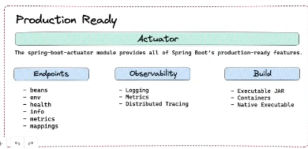
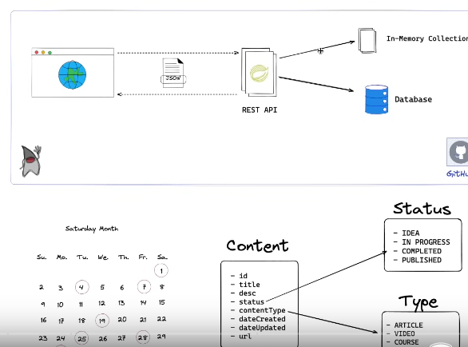
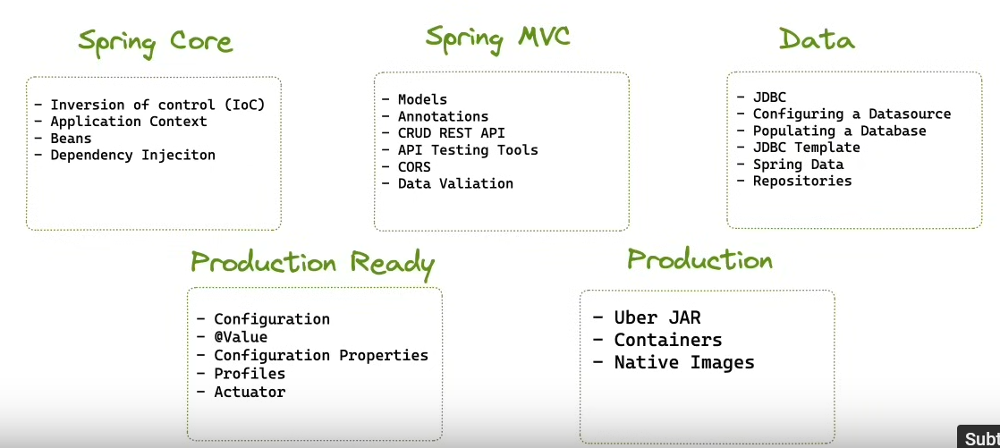
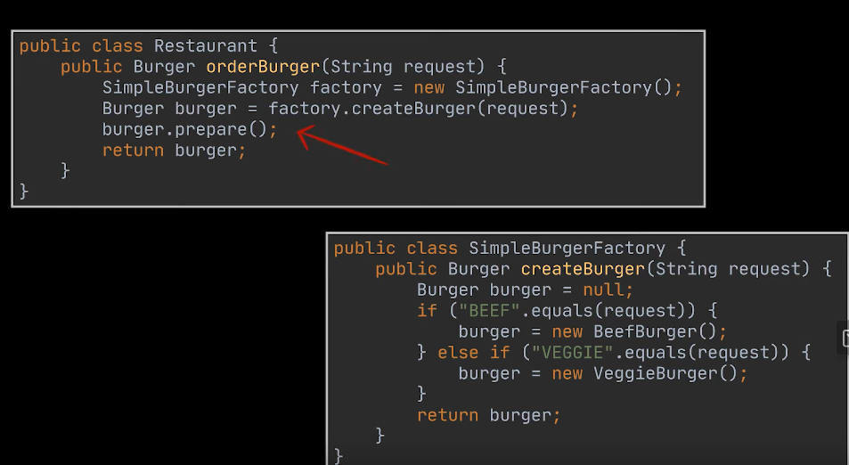
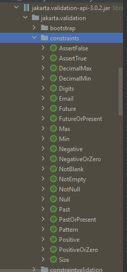

# Java Spring Boot - Web App Project
Java Spring Boot Project, with Web Gateway and Microservices, AWS, Github.


-------
**POST PROJECT NOTES:**

Currently Project is a project that utilises Spring Boot Web Framework,making Controllers with annotations, Models using JBDC to make a working REST API, it is very rudimentary with no addition to authentication, postgres connection etc, but serves as a starting point for future development of SpringBoot Projects, I do like Django more due to ORM and simplicity, this does seem a bit more verbose.

To improve on project, I would like to make a web app specifically useful in my domain, such that I can implement multiple images and possible implement a web gateway like mentioned in YouTube video (Cloud Gateway): https://www.youtube.com/watch?v=EKoq98KqvrI, in addition to this deploying this on a cloud platform like AWS.


-------
## Start of Development Notes

The video that my project follows is:
https://www.youtube.com/watch?v=UgX5lgv4uVM

I am to learn to be familiar with Spring Framework, such as concepts Beans, Application Context, Inversion of Control, Dependency Injection.

This will use different parts of Spring MVC and Spring Data, to make a REST API and deploying an application to production.

----

#### Prerequisites
To understand this project, we should know how to code in Java 17, and build tools like Maven or Gradle.

API Testing with Postman which we usually do informally.

We will aim to deploy this application using Docker.

---

#### Spring & Spring Boot


Spring Framework, used for a variety of applications,
 Webapps, secure, responsive, that connects to any data store.

Spring MCV, but if we want some asynchronous working, more reactive we could use something called Spring Webflux.

You can use Spring to make quick microservices and production grade features with independently evolveable microservices.

Spring cloud, allows the deployment of apps, with services aiding in building.

Spring Cloud functions is similar to Lambda but for Java Spring specifically, but allows the deployment of this serverless codebase to AWS or Azure with no changes.

React to Business Events, or Batching, may be useful to have this while using Power BI.

Spring allows the development of all these applications, but Spring Boot allows we will simplify the web development, 
with 3 different components,

- Spring Boot Starter  (Create New Project, declare pom.xml has all project dependencies for Spring and version.)  # Spring boot starter web, making all of the packages needed.
  
**What is tomcat and jackson? (in Java).**

- Auto Configuration (Spring Starter Web) is we connecting to a database, we may want a data source configuration made, or a database driver, provide defaults, or based on development, connected to database more easily.

- Production Ready, actuators module, provides spring boots production ready features, we get endpoints, insights for the webserver, what are all the beans in our application. What is the health of our application is it up and running etc. Connection to database working?





------
#### Webapp Project Details

For this project, we will build a REST API that communicates with a webapp via JSON data, and also communicate with Databases and In-Memory Collection. This



- We will go in to JWC template to communicate structure in JSON.

- Web Gateway, will be the entry point for the webapp, and will communicate with the microservices.

We will be content calendar, which shows what I build or what I will build in terms of content, with status and type, as shown in the image above.

------

We will start project using `start.spring.io` and understand SpringBoot quicker. In this project, the scope will cover the main 5 stages, 
which includes:

- Spring Core
- Spring MVC (Model View Controller)
- Spring Data
- Production Ready
- Production

Shown in the diagram below:



When starting, we will go into dependencies, examine the pom.xml file, spring boot starters, dependency versions, @SpringBootApplication annotation.


We will be using Java 17 as it is the most recent LTS version, offering a good balance between stability and access to modern Java features.

------
To start of the project, head over to https://start.spring.io/ and fill the details to have a project structure generated with the specific dependencies and spring boot ready for us.

----
To start the spring boot project, every thing has to be within the contentcalender, and on top of this, the Application can be run from the maven shortcut in plugins spring-boot:run.

I did recap a bit in terms of the differences between a interface and abstract class using this video: https://www.youtube.com/watch?v=HvPlEJ3LHgE

But before we go into the coding, we need to understand a few core concepts about Spring, which is shown in ref docs, https://docs.spring.io/spring-framework/reference/index.html

-----------
**Factory Design Pattern,**

I did not know about this pattern, but its usecase is clear, it tries to follow SOLID principles and stop code staying open for edits.
Instead a factory is made for conditional object returns like a chicken or veggie burger extended by Burger abstract class.
As shown in the image below, and linked in video: https://www.youtube.com/watch?v=EdFq_JIThqM



The Factory Method Design Pattern, loosens the coupling, from products construction and from code that uses this product.


----------

Spring Core, https://docs.spring.io/spring-framework/reference/core.html

What are beans?

Creating an instance of a class, Spring bean is a instance of a class with metadata, name and scope etc.
This application class, how do we make our own bean.

New Java Class called message for example.

Say for example you have a class you don't control like from a factory method and you want to make it a bean, 
you can do so by first annotating the base class as @Configuration and then the method returning the object as @Bean.

At class level it has a decorator/annotation of @Component

There is more information in the documentation, but for now, we will just follow the tutorial understanding the high level and Java concepts such that we can do well and not have issues later on for now.

----------

#### Spring MVC

We start in the model package, where we make a Content.java file that stores a Java Record named content,

Currently, we have forgotten what a record is, so video: https://www.youtube.com/watch?v=gJ9DYC-jswo mentions this here.

We taught this in Procedural Programming, it just contains records, and no functions, it's like an object holding information like Employee records.

No need to make private instances, with public setters and constructors, as well as string and hashcode representation.

```java
    public record EmployeeRecord (String name, int employeeNumber) {};
   // this will create an employee record with private fields without the need of creating a long class ourselves.
```

We now have created a record of type Content, that has all the fields we are interested in, now we move onto the controller.


**Controller**

We make a controller with the name convention being {ModelName}Controller,

For this class, this is like the views.py and urls.py function in one place, 

In which the application context can see because we have highlighted it with 2 important decorators, which are:

```java
    import org.springframework.web.bind.annotation.RequestMapping;

@RestController  // telling App this should be controlling the model.
@RequestMapping("some/url/path/") // This tells us when this method is called.
public class {ModelClass}Controller {};
```

**Local Database Temporary Solution**
In the tutorial we are not using a database just yet, so instead we use another subpackage within the java app called /repository/ which contains the class `ContentCollectionRepository`

This will store the actual repository, models in memory, to be stored, while we do not have a database.

To do this a class is made and has the decorator `@Repository`

Which you can see the code written in the ContentCollectionRepository file I made, under the subpackage repository.


**Optionals in Java: Explained**
Lecturer mentions that Optionals in Java are used to handle the null problem, in the repository code, we deal with a situation where
we try to find a object from the records that is either found or null, 
in the case that we use the function it is possible to receive null and we cant check easily if it is the object or null.

Like in Python, None.is_exists() will give an error because its None,
But if we use an Optional which has a built-in function called isPresent(), before we do anything we can do this check and not have NullPointerExceptions invoking methods that do not exist.


Within our controller I have completed all the controls needed with the model, and how this interacts with the repository, which acts like our database.


-------
#### Handle CORS
Allowing specific domains to talk with this API, but how will we do this. To do this, we can use a decorator named, `@CrossOrigin` on the function/class level of a controller which will deal with setting domains and methods allowed for usage in communicating with this server.

--------
#### Handling User Input

To handle, we need an additional dependency, called, spring-boot-starter-validation, which allows for this addition,

```xml
    <dependency>
      <groupId>org.springframework.boot</groupId>
      <artifactId>spring-boot-starter-validation</artifactId>
   </dependency>
```

We can work on the input validation on the specific records mentioned in the model subpackage.
These can be added as decorators below the specific field in the fields, here are some constraints shown below:


This also needs to be within the controller function must have a `@Valid` within the function.

```java
    @ResponseStatus(HttpStatus.CREATED)
    @PostMapping("create/")
    public void createContent(@Valid @RequestBody Content content){
        this.repository.addContent(content);
    }
```

------
#### Persistent Data Source / JDBC/ Spring Data
Up until now, we have only worked on using Java Spring Boot project with just repository storing our data in array lists, now we will migrate to a more persistent data source.

This requires 2 dependencies, which include:
- `org.springframework.boot:spring-boot-starter-jdbc`
- `com.h2database.h2`

main] com.zaxxer.hikari.HikariDataSource       : HikariPool-1 - Starting...
2024-04-06T18:41:06.429+01:00  INFO 22824 --- [content-calender] [main] com.zaxxer.hikari.pool.HikariPool        : HikariPool-1 - Added connection conn0: url=jdbc:h2:mem:835e74a8-a293-4852-a51f-328b571f5af1 user=SA
2024-04-06T18:41:06.435+01:00  INFO 22824 --- [content-calender] [main] com.zaxxer.hikari.HikariDataSource       : HikariPool-1 - Start completed.

So now in the boot, we have this h2 console available at /h2-console, looking at it via the website.

URL: http://localhost:8080/h2-console/

We can access it through the JDBC URL from field.

As you can see, there is no trouble in making a database, all we literally did was add the dependency, and now we have a running database, which is perfect, autoconfiguration of springboot and jdbc and did it instantly.

In this tutorial we rely on h2 database, as its really useful and easy to use and operates on the local machine, but the lecturer also does show how to run this using a custom db conn.


**If we want a postgres database connection**
We remove all these application properties to do with h2, and the dependency on h2, and add postgres dependency to be used.
We install the dependency, and add the configuration lines to the properties shown in comments.

```md
    spring.datasource.url=jdbc:postgresql://localhost:5432/postgres
    spring.datasource.username=postgres
    spring.datasource.password=password
```

There are many ways of inserting data in a database, like a schema file, or programmatically or a database migration tool, like Flyway tool for changes to a db scriptable for git.

H2 is an in-memory database so will be wiped everytime, so should only use in development.

This still uses SQL, and feels a bit outdated when there are quite good ORMS available with other programming web frameworks such as Django, SQLAlchemy, I hope they have a solution for SpringBoot.

**Spring Data**
Powerful repository, object mapping abstractions, dynamic query derivation, out of the box SQL, NOSQL support easier, which is good.

------
**Continue the Video starting at (2:21:33/3:43:51)**


------
So for now we will skip the 40-min part about spring data, as we have a general idea of repositories and although this has potential, I see Django as a more useful and efficent approach.

We will discuss how to push this into production:

We could compile the Java project into a JAR file very easily using Maven, but if using another build tool, 
`java -jar target/content-calendar-0.0.1-SNAPSHOT.jar` can aid in this process and be present in `target/` directory.

Now this can run anywhere than has a JDK, containing things like a virtual machine for java bytecode running, however what if we do not have Java on our host,

And want to run in a container like docker, then the following commands will aid in this:

```bash

   ./mvnw spring-boot:build-image

   docker image ls -a
   
   docker run -it -p8080:8080 content-calendar:0.0.1-SNAPSHOT

```


However, there is now better alternatives like makjing native executable images that are faster in memory and execution then docker using the command:

`mvn -Pnative native:compile`

The result will be a native executable in the `target/` directory.

To build the image, you can run the `spring-boot:build-image` goal with the native profile active:

`mvn -Pnative spring-boot:build-image`
